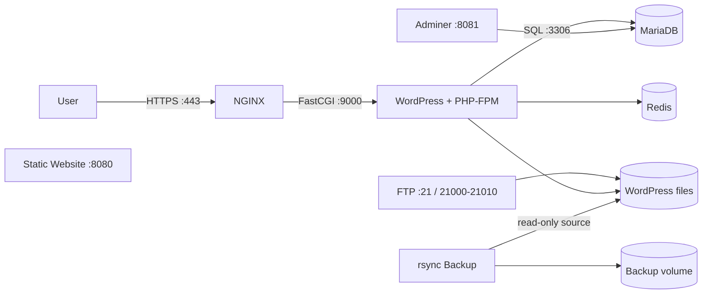

*This project has been created as part of the 42 curriculum by **kamrene**.*

# Inception

Inception is a 42 system administration project focused on building a small, containerized web infrastructure with Docker Compose.

The project separates each service into its own container, keeps persistent data outside the containers, uses Docker secrets for sensitive values, and secures the main WordPress entrypoint with NGINX and TLS.

## Architecture



## Services

| Service | Role | Exposed port(s) |
| --- | --- | --- |
| **NGINX** | HTTPS entrypoint and TLS termination | `443` |
| **WordPress** | Website application running with PHP-FPM | Internal `9000` |
| **MariaDB** | WordPress database | Internal `3306` |
| **Redis** | WordPress object cache | Internal |
| **FTP** | Access to WordPress files | `21`, `21000-21010` |
| **Adminer** | Database web interface | `8081` |
| **Static website** | Separate static site | `8080` |
| **Backup** | `rsync` backup of WordPress files | None |

> The mandatory WordPress stack is reached through NGINX on HTTPS port `443`. Bonus services expose their own ports where required.

## Main design choices

- One service per container.
- NGINX is the entrypoint for the main WordPress website.
- TLS is restricted to **TLS 1.2** and **TLS 1.3**.
- WordPress runs with **PHP-FPM** instead of an embedded web server.
- MariaDB runs in its own isolated container.
- Redis is used as a WordPress cache.
- Docker secrets store passwords and credentials.
- Containers communicate through a dedicated Docker bridge network named `inception`.
- Persistent database and WordPress data are stored under `/home/kamrene/data`.
- The backup service uses `rsync` and a dedicated backup volume.

## Project structure

```text
.
├── Makefile
├── README.md
├── secrets/
│   ├── credentials.txt
│   ├── db_password.txt
│   └── db_root_password.txt
└── srcs/
    ├── .env
    ├── docker-compose.yml
    └── requirements/
        ├── mariadb/
        ├── nginx/
        ├── wordpress/
        └── bonus/
            ├── adminer/
            ├── backup/
            ├── ftp/
            ├── redis/
            └── static-website/
```

## Prerequisites

You need:

- Docker
- Docker Compose
- Linux
- A local domain configured as `kamrene.42.fr`

Create the persistent host directories before starting the stack:

```bash
mkdir -p /home/kamrene/data/db
mkdir -p /home/kamrene/data/wordpress
```

Make sure `kamrene.42.fr` resolves to the machine running Docker. For local testing, this can be configured in `/etc/hosts`.

## Configuration

### Environment variables

The main configuration is stored in `srcs/.env`:

```env
LOGIN=kamrene
DOMAIN_NAME=kamrene.42.fr

MYSQL_DATABASE=wordpress
MYSQL_USER=wp_user
MYSQL_PASSWORD_FILE=/run/secrets/db_password
MYSQL_ROOT_PASSWORD_FILE=/run/secrets/db_root_password

WP_TITLE=Inception
WP_CREDENTIALS_FILE=/run/secrets/credentials
```

### Secrets

Sensitive values are kept outside Dockerfiles and normal environment variables:

```text
secrets/db_password.txt
secrets/db_root_password.txt
secrets/credentials.txt
```

Do not commit real credentials to a public repository.

## Build and run

From the project root:

```bash
make up
```

This builds the images and starts the infrastructure in detached mode.

### Useful Makefile commands

```bash
make up      # build and start
make down    # stop the stack
make re      # recreate the containers
make ps      # show container status
make logs    # follow logs
```

### Docker Compose commands

If you prefer to run Compose directly:

```bash
docker compose -f srcs/docker-compose.yml --env-file srcs/.env up -d --build
docker compose -f srcs/docker-compose.yml --env-file srcs/.env down
```

To remove containers and volumes:

```bash
docker compose -f srcs/docker-compose.yml --env-file srcs/.env down -v --remove-orphans
```

## Access

| Component | Address |
| --- | --- |
| WordPress | `https://kamrene.42.fr` |
| Static website | `http://kamrene.42.fr:8080` |
| Adminer | `http://kamrene.42.fr:8081` |
| FTP | `kamrene.42.fr:21` |

The NGINX certificate is self-signed, so browsers will normally display a certificate warning in this local lab environment.

Test the main website with:

```bash
curl -k https://kamrene.42.fr
```

## Verification and troubleshooting

### Check running containers

```bash
docker ps
```

### View logs

```bash
docker compose -f srcs/docker-compose.yml --env-file srcs/.env logs
docker compose -f srcs/docker-compose.yml --env-file srcs/.env logs nginx
docker compose -f srcs/docker-compose.yml --env-file srcs/.env logs wordpress
docker compose -f srcs/docker-compose.yml --env-file srcs/.env logs mariadb
```

### Verify TLS versions

```bash
openssl s_client -connect kamrene.42.fr:443 -tls1_2
openssl s_client -connect kamrene.42.fr:443 -tls1_3
openssl s_client -connect kamrene.42.fr:443 -tls1_1
openssl s_client -connect kamrene.42.fr:443 -tls1
```

Expected result:

- TLS 1.2 works.
- TLS 1.3 works.
- TLS 1.1 fails.
- TLS 1.0 fails.

### Check Redis

```bash
docker exec -it redis redis-cli ping
```

Expected response:

```text
PONG
```

### Check backup files

```bash
docker exec -it backup sh
ls -la /backup
```

## Key concepts

### Docker vs virtual machines

A virtual machine runs a complete guest operating system with its own kernel. Docker containers share the host kernel, so they are lighter, start faster, and are well suited to isolating individual services.

### Secrets vs environment variables

Environment variables are appropriate for normal configuration such as domain names, database names, and usernames. Passwords and credentials are more sensitive, so this project provides them to containers through Docker secrets.

### Docker bridge network vs host network

The custom bridge network keeps the services logically isolated while allowing containers to reach each other by service name, for example `wordpress`, `mariadb`, and `redis`. Host networking would remove much of that isolation.

### Persistent storage

`db` and `wp` are Docker named volumes configured with the local volume driver to store data in host directories:

```text
/home/kamrene/data/db
/home/kamrene/data/wordpress
```

This keeps the data available when containers are recreated.

## Bonus services

### Redis

Redis provides object caching for WordPress and reduces repeated database work.

### FTP

The FTP container mounts the same WordPress storage, allowing controlled file access to the website files.

### Adminer

Adminer provides a lightweight browser interface for inspecting the MariaDB database.

### Static website

A separate static website is served without PHP.

### Backup

The additional backup service mounts the WordPress volume as read-only and synchronizes its contents to a separate backup volume with `rsync`.

## Resources

Useful references for this project include:

- Docker documentation
- Docker Compose documentation
- NGINX documentation
- MariaDB documentation
- WordPress documentation
- Redis documentation
- Adminer documentation
- vsftpd documentation
- OpenSSL documentation

## AI usage

AI was used as a support tool to help:

- understand and clarify project requirements;
- explain Docker, networking, TLS, and volume concepts;
- troubleshoot container startup and configuration issues;
- understand Redis, FTP, Adminer, and backup integration;
- improve project documentation.

All suggestions were reviewed, tested, and adapted during implementation.

## Author

- **Login:** `kamrene`
- **Project:** Inception
- **School:** 1337
